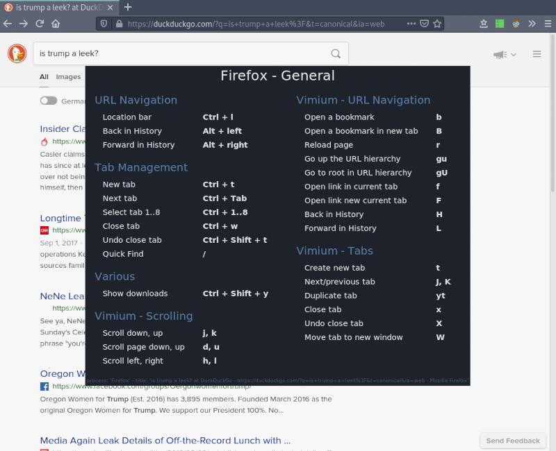
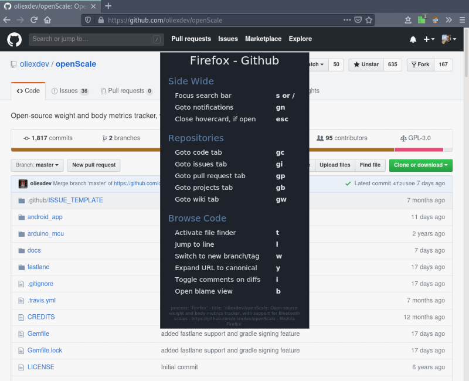
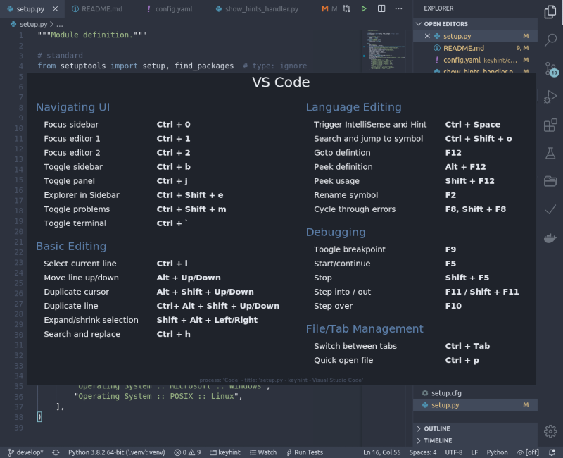
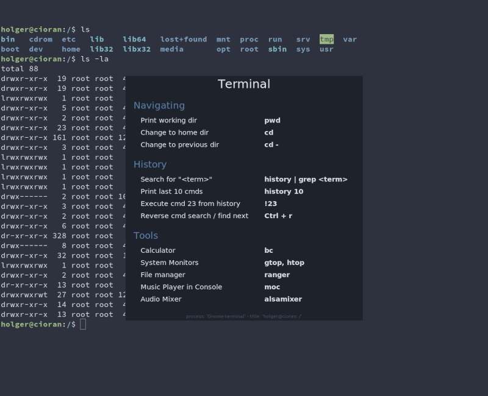

# keyhint

**_Display context-sensitive keyboard shortcuts or other hints on Linux or Windows._**

 

## Usage

The tool can be started by `python -m keyhint` or simply `keyhint`. But as the **keyhint** displays hints based on the currently active window, you probably want to configure a **global hotkey** to trigger it on demand.

Based on the **process name** and **window title**, different sets of hints can be displayed.

_General Firefox Shortcuts:_

_Shortcuts on GitHub:_

_VSCode Keybindings:_

_Shell Commands:_

## Installation

`pip install keyhint`

## Configuration

### Look & Behavior

You can configure colors, font and closing behavior by modifying

`<CONFIG_PATH>/keyhint/config.yaml`

### Hints

You can also configure the hints to show for different applications by modifying or adding section in

`<CONFIG_PATH>/keyhint/hints.yaml`

The shown hints are selected by going through all sections from top to bottom and comparing the value of `regex_process` with the process name of the active window and the value of `regex_title` with the title of the active window. The first section, where both values are found, gets displayed.

(Both of those `regex_` values are interpreted as **case insensitive regular expressions**!)

### Notes

The `<CONFIG_PATH>` can be different from system to system, on Linux it's usually `~/.config`, on Windows it should be `C:\Users\<YOURNAME>\AppData\Roaming`.

You can reset configuration or hints to the shipped version by deleting the `yaml` files from the configuration folder.

## Tips

**Differentiate Websites:**

For showing different browser-hints depending on the current website, you might want to use a browser extension like "[Add URL To Window Title](https://addons.mozilla.org/en-US/firefox/addon/add-url-to-window-title/)" and then configure the sections in `hints.yaml` to look for the URL in the window title.

**Differentiate Multi Platform:**

Sometimes the hints you want to show are the same for e.g. Linux and Windows. In that case, you might want to set e.g. `regex_process: firefox.*` to match with `Firefox` (Linux) as well as with `Firefox.exe` (Windows).

If you want to show different hints for the same tool depending on the platform, use two sections, one with `regex_process: firefox(?!\.exe)` (Linux) and one with `regex_process: firefox\.exe` (Windows).

## Contribute

I'm happy about any contribution! Especially I would appreciate submissions to improve the [shipped hints](https://github.com/dynobo/keyhint/blob/master/keyhint/config/hints.yaml). (The current set are the hints I personally use).

## Design Principles

- **Multi-Platform** Should work on Linux, Mac (not yet achieved) & Windows.
- **Don't run as service** It shouldn't consume resources in the background, even if this leads to slower start-up time.
- **No network connection** Everything should run locally without any network communication.
- **Dependencies** The fewer dependencies, the better.
- **Chain of Responsibility as main design pattern** [See description on refactoring.guru](https://refactoring.guru/design-patterns/chain-of-responsibility)
- **Multi-Monitors** Supports setups with two or more displays

## Certification

